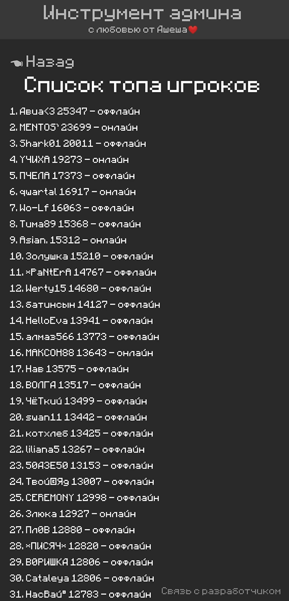
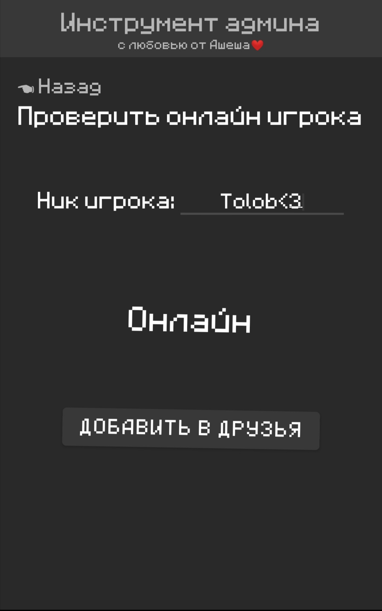
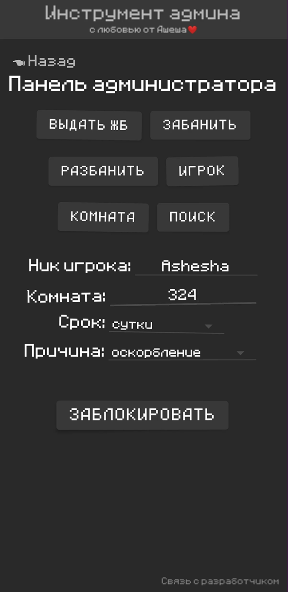
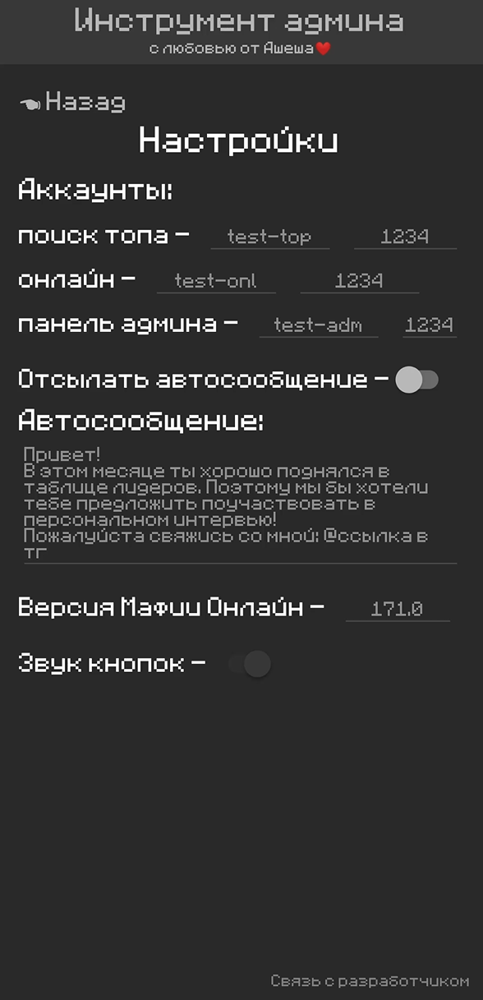

# AdminTool

AdminTool is a private Android application designed as a tool for administrators of the "Mafia Online" game. It simplifies the management of various administrative functions. Upon launching the application, users are presented with the main page featuring four buttons for navigating to different sections: Top Players (displaying the list of top players for the current month), Check Online (verifying the online status of a player and sending friend requests), Admin Panel (providing admin tools), and Settings.

## Table of Contents

- [Usage](#usage)
- [Features](#features)
- [Screenshots](#screenshots)
- [License](#license)

## Usage

1. Download the AdminTool APK from the [release page](https://github.com/McAshesha/AdminTool/releases).

2. Install the APK on your Android device.

3. Open the AdminTool application.

4. Use the intuitive interface to navigate between different sections and access admin tools.

## Features

- **Top Players**: View the list of top players for the current month.
- **Check Online**: Verify the online status of a player and send friend requests.
- **Admin Panel**: Access various admin tools to manage the game efficiently.
- **Settings**: Configure application settings and preferences.

## Screenshots

*Main Menu Section*

*Top Players Section*

*Check Online Section*

*Admin Panel Section*

*Settings Section*

## License

AdminTool is distributed under the MIT License. See [LICENSE](LICENSE) for more information.

Feel free to contribute or report issues by creating pull requests or submitting bug reports. Enjoy using AdminTool for streamlined administration in "Mafia Online"!