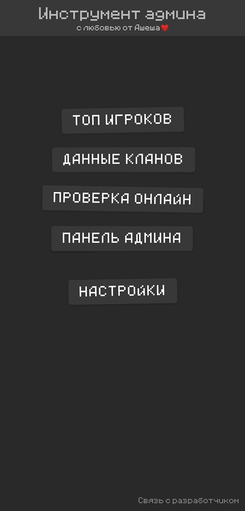
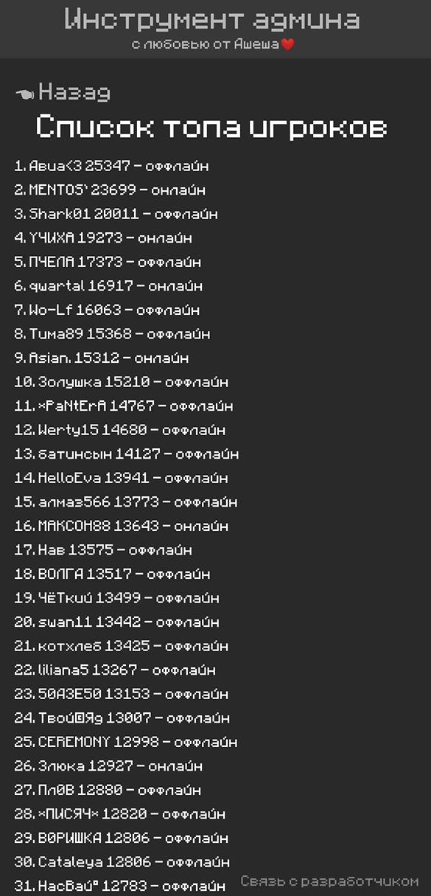
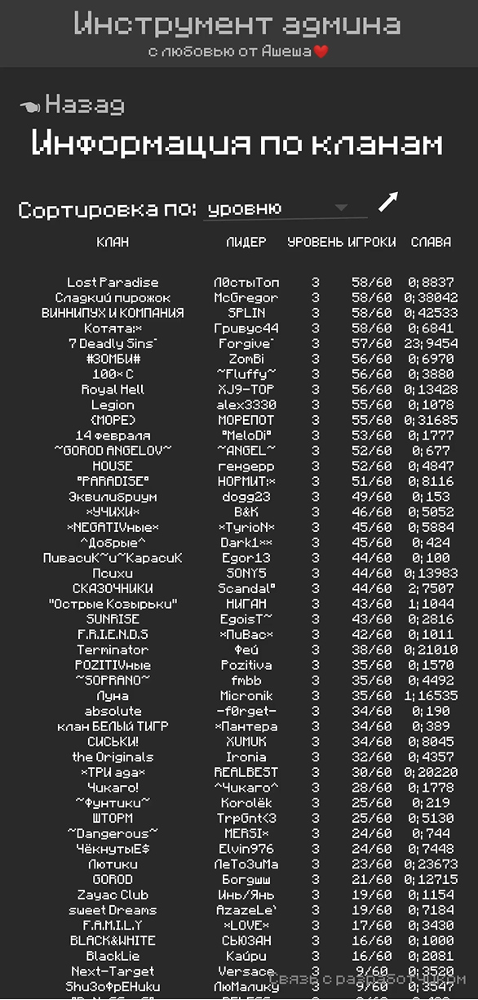
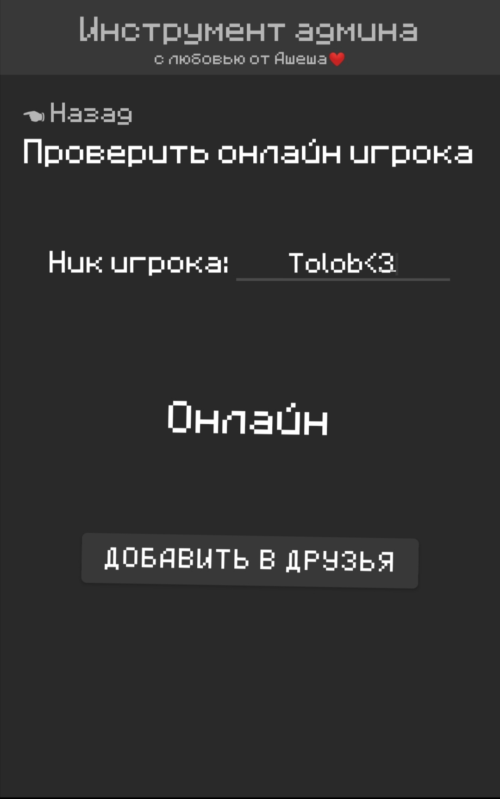
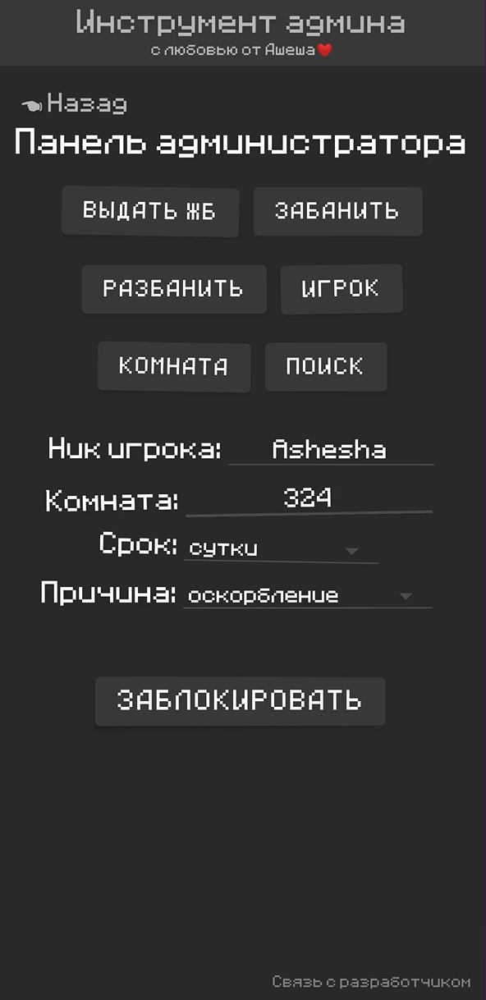
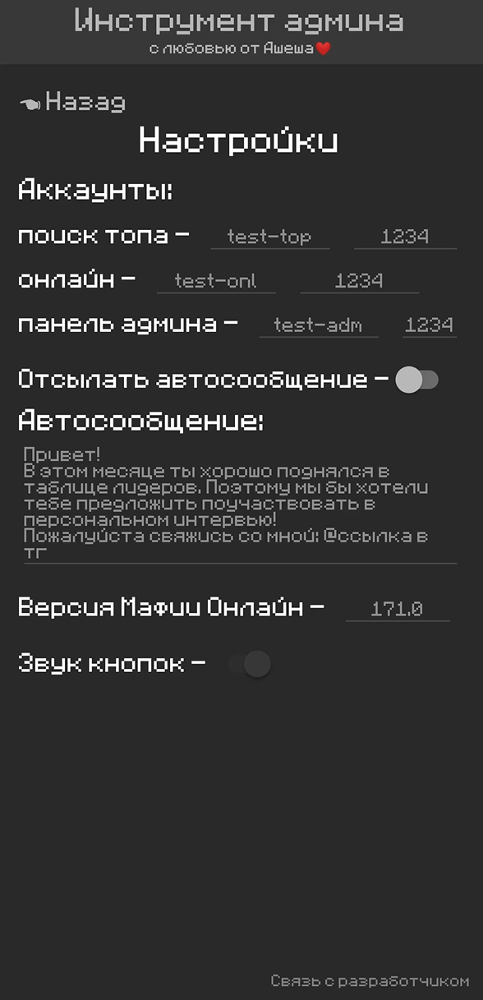

# admin-tool

admin-tool is a private Android application designed as a tool for administrators of the "Mafia Online" game. It simplifies the management of various administrative functions. Upon launching the application, users are presented with the main page featuring buttons for navigating to different sections. 

## Table of Contents

- [Usage](#usage)
- [Sections](#sections)
- [Screenshots](#screenshots)
- [License](#license)

## Usage

1. Download the admin-tool APK from the [release page](https://github.com/McAshesha/admin-tool/releases).

2. Install the APK on your Android device.

3. Open the admin-tool application.

4. Use the intuitive interface to navigate between different sections and access admin tools.

## Sections

- **Top Players**: View the list of top players for the current month.
- **Clans Data**: View the list of all clans, sorted by your desires.
- **Check Online**: Verify the online status of a player and send friend requests.
- **Admin Panel**: Access various admin tools to manage the game efficiently.
- **Settings**: Configure application settings and preferences.

## Screenshots

*Main Menu Section*

*Clans Data Section*

*Clans Data Section*

*Check Online Section*

*Admin Panel Section*

*Settings Section*

## License

admin-tool is distributed under the MIT License. See [LICENSE](LICENSE) for more information.

Feel free to contribute or report issues by creating pull requests or submitting bug reports. Enjoy using admin-tool for streamlined administration in "Mafia Online"!
